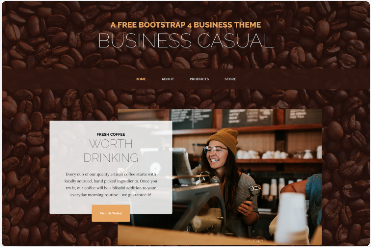

#porkGo!
## Realizar un maquetado como se muestra en la imagen
```

```
## Cada persona realizará 2 elementos html y 1 estilado css

### Al finalizar deberá generar un pull request al repositorio de porkGo!


```
# El próximo siempre generar un git pull antes de comenzar a agregar nuevos elementos en los archivos
```
